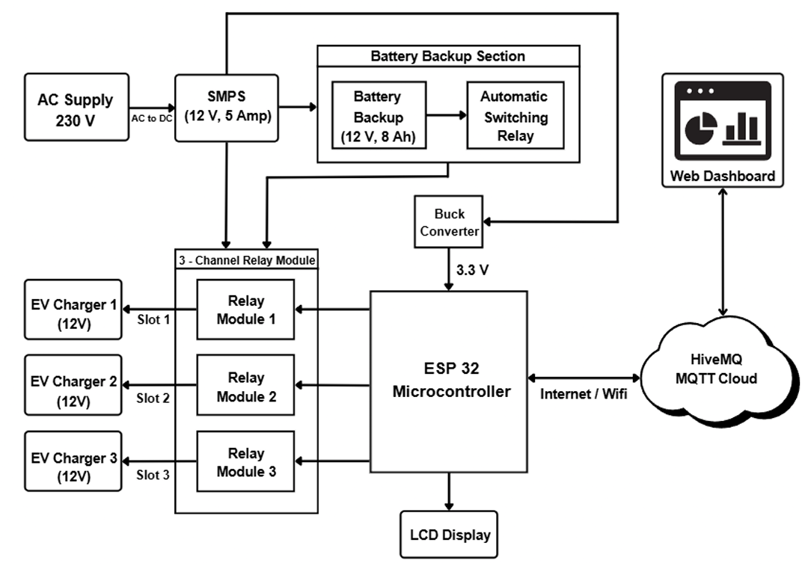
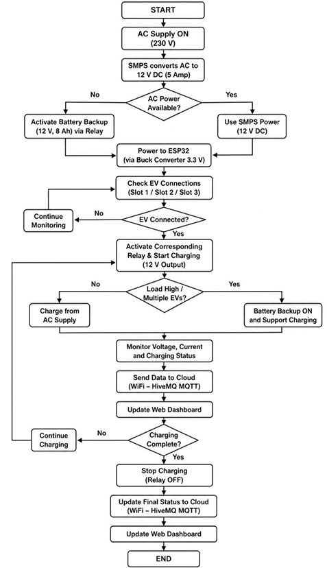
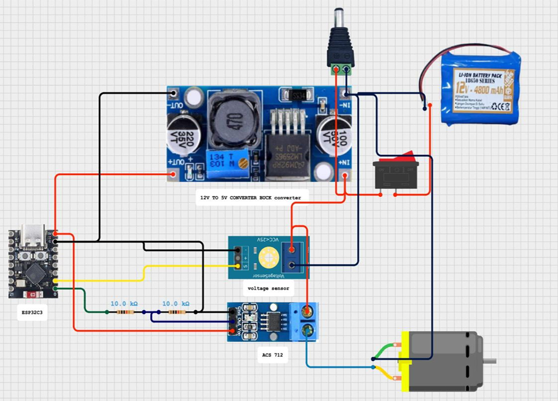
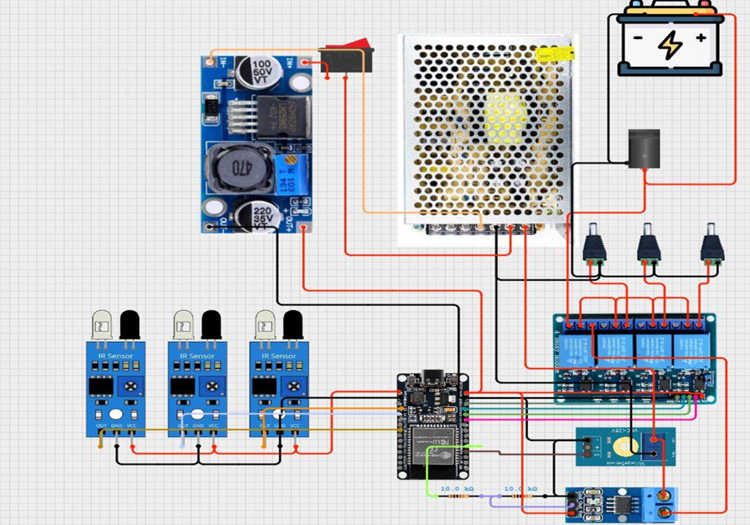
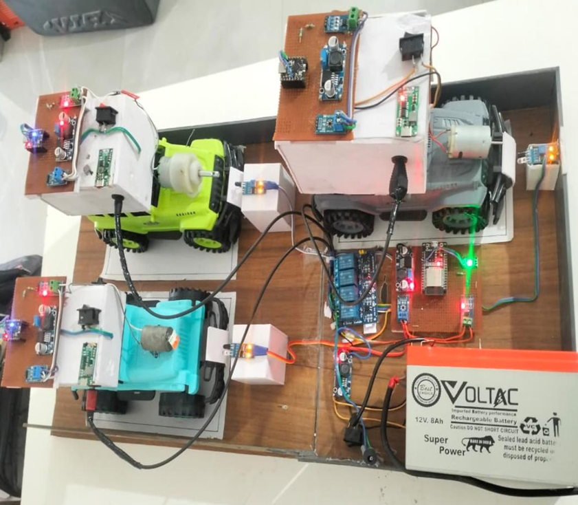

# Smart EV Charging Station with AI-Based Load Prediction and Management


## Project Overview
This project is an AI-enabled Smart EV Charging Station designed to manage multiple electric vehicle charging slots using ESP32 microcontrollers and MQTT-based cloud communication. The system provides real-time monitoring of voltage, current, power, charging status, battery percentage, and station load through a web-based dashboard.

The prototype supports three smart charging slots with a maximum station load capacity of approximately 128W. It includes AI-based load prediction for forecasting peak demand, intelligent load balancing to prevent overload conditions, dynamic pricing based on load conditions, and battery backup for uninterrupted charging. The system also supports slot booking, cloud-connected monitoring using HiveMQ MQTT broker, and centralized control through dedicated User and Admin dashboards.


## Features
1. Three smart EV charging slots with independent monitoring and control.
2. Real-time monitoring of voltage, current, power, battery percentage (SOC), and charging status.
3. Cloud-based communication using the HiveMQ MQTT broker for live data exchange.
4. AI-based load prediction for forecasting peak demand and charging load trends.
5. Intelligent load balancing to prevent overload conditions and optimize power distribution.
6. Smart slot booking with dynamic pricing based on station load, peak demand, and slot availability.
7. User Dashboard for real-time charging monitoring, booking, and billing information.
8. Admin Dashboard for centralized control, analytics, system health monitoring, and emergency shutdown operations.


## Architecture


The system consists of three ESP32-C3 based EV nodes, one ESP32 station controller, HiveMQ Cloud MQTT broker, and a web-based monitoring dashboard. Sensor data is collected from each charging slot, transmitted through MQTT, processed for load analysis and AI prediction, and displayed on the User and Admin dashboards for real-time monitoring and control.

The block diagram illustrates the complete power management and monitoring architecture of the Smart EV Charging Station. The station operates from a 230V AC supply, which is converted to 12V DC using a 12V, 5A SMPS. This DC power is distributed to three EV charging slots through a 3-channel relay module controlled by the ESP32 microcontroller.

The system is designed to monitor multiple EV batteries simultaneously: EV1 (5500mAh), EV2 (3300mAh), and EV3 (2200mAh). The total charging load of the station is approximately 128W. The ESP32 continuously monitors charging parameters such as voltage, current, power, battery percentage, and charging status for each slot in real time.

A dedicated battery backup section consisting of a 12V, 8Ah battery and an automatic switching relay provides power support during high-load conditions. When the station load increases beyond the predefined safe limit, the relay logic automatically activates the battery backup to assist the SMPS and maintain uninterrupted charging operation.

The ESP32 communicates with the HiveMQ Cloud MQTT broker over Wi-Fi, and the web dashboard displays live charging data, load analytics, slot status, and system alerts. This architecture enables real-time monitoring, intelligent load management, automatic backup activation, and centralized control of the EV charging station.


## Technologies Used
- Arduino IDE
- ESP32 Arduino Framework
- HTML5
- CSS3
- JavaScript
- MQTT Protocol
- MQTT.js
- Chart.js
- HiveMQ Cloud
- IoT Communication
- AI-Based Load Prediction


## Hardware Components
- ESP32-C3 Dev Board (3 Units)
- ESP32 WROOM Dev Module (1 Unit)
- ACS712-5A Current Sensor Module (4 Units)
- Voltage Divider Circuit using 30kΩ and 7.5kΩ Resistors (4 Units)
- 4-Channel Relay Module (1 Unit)
- IR Proximity Sensor / FC-51 Module (3 Units)
- WS2812B NeoPixel LED (4 Units)
- 3S Li-ion Battery Pack – 5500mAh (1 Unit)
- 3S Li-ion Battery Pack – 3300mAh (1 Unit)
- 3S Li-ion Battery Pack – 2200mAh (1 Unit)


## Project Workflow
1. IR sensors detect vehicle presence at charging slots.
2. ESP32-C3 vehicle nodes measure voltage, current, power, and battery percentage.
3. Sensor data is published to HiveMQ Cloud using the MQTT protocol.
4. The station controller receives and processes charging data from all slots.
5. AI-based load prediction analyzes charging demand and load trends.
6. Load balancing logic distributes power across active charging slots.
7. Slot booking and dynamic pricing are updated based on load conditions.
8. User and Admin dashboards display real-time charging status, analytics, and system control information.


## Project Structure
```
Smart-EV-Charging-Station/
├── dashboard/
│   ├── admin.html
│   └── user.html
│
├── doc/
│   └── Project Report.pdf
│
├── firmware/
│   ├── EV_NODE_V1_MQTT.ino
│   ├── EV_NODE_V2_MQTT.ino
│   ├── EV_NODE_V3_MQTT.ino
│   └── ev_station_firmware.ino
│
├── images/
│   ├── circuits/
│   │   ├── station_controller_circuit.png
│   │   └── vehicle_node_circuit.png
│   ├── block_diagram.png
│   ├── flow_chart.png
│   └── prototype.png
│
└── README.md
```


## Project Screenshots

### Block Diagram


### System Flow Chart


### Vehicle Node Circuit


### Station Controller Circuit


### Hardware Prototype


### User Dashboard


### Admin Dashboard


## Results
- Real-time monitoring of voltage, current, power, and battery percentage was successfully achieved.
- MQTT communication between ESP32 nodes and HiveMQ Cloud was established successfully.
- AI-based load prediction logic was integrated for charging load analysis.
- Intelligent load balancing and overload prevention were implemented across multiple charging slots.
- Smart slot booking and dynamic pricing functionality were demonstrated through the web dashboard.
- User and Admin dashboards provided centralized monitoring and control of the charging station.

## Project Demo
[Watch Working Video](https://drive.google.com/file/d/1uITe59IkMRqmYF3rqKIGvO9TktbGh2aG/view?usp=drivesdk)

## Future Improvements
- Integration with online payment gateways
- Mobile application support
- Renewable energy integration with solar charging
- Advanced AI forecasting using machine learning models
- Cloud database integration for historical analytics
- Fast-charging support for higher power EV systems


## Authors

- [Tushar Ballak](https://github.com/tusharballak25)
- Tejas Gangarde
- [Uday Gawande](https://github.com/udaygawande93)


